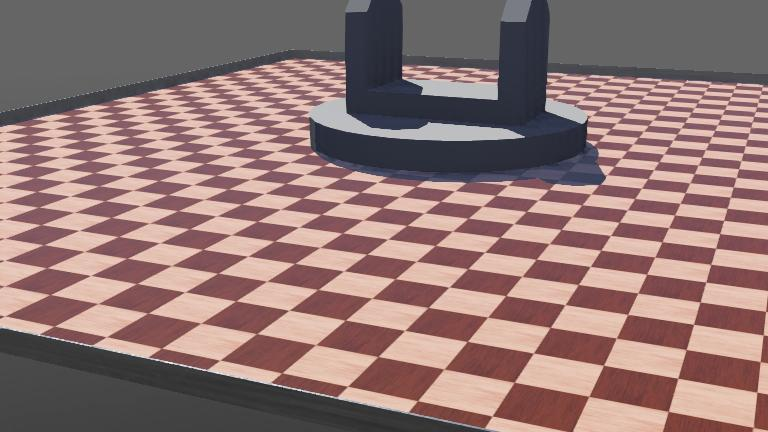

# Brazo Robótico

Simulación de un brazo robótico de 3 segmentos con pinza en [Webots R2025a](https://cyberbotics.com/). Los modelos 3D fueron creados en Blender 4.0.2.



## Tecnologías

- **Webots R2025a** — simulador de robots open-source
- **Blender 4.0.2** — modelado 3D
- **Formato 3D:** OBJ + MTL
- **Controlador:** Python (Supervisor API)

## Estructura del proyecto

```
brazo_robotico/
├── brazo-robotico/              # Modelos 3D del brazo
│   ├── base.obj / base.mtl      # Base del brazo
│   ├── brazo-1.obj / brazo-1.mtl  # Segmento de brazo
│   └── garra.obj / garra.mtl    # Efector final (garra)
├── controllers/
│   └── robot_brazo/
│       └── robot_brazo.py       # Controlador principal (Supervisor)
├── worlds/
│   ├── brazo_robotico.wbt       # Mundo principal de la simulación
│   └── .brazo_robotico.jpg      # Preview
├── Dockerfile                   # Para webots.cloud
├── webots.yml                   # Configuración de publicación
└── README.md
```

## Requisitos previos

- [Webots R2025a](https://cyberbotics.com/#download) instalado

## Cómo ejecutar

1. Abre Webots.
2. Ve a `File > Open World...` y selecciona `worlds/brazo_robotico.wbt`.
3. La simulación se iniciará automáticamente con el controlador.

## Controles

| Tecla | Acción |
|---|---|
| ← / → | Rotar base |
| ↑ / ↓ | Mover hombro (brazo 1) |
| A / D | Mover codo (brazo 2) |
| Q / E | Mover muñeca (brazo 3) |
| W | Cerrar garra y agarrar objeto cercano |
| S | Abrir garra y soltar objeto |

Al presionar **W**, el controlador busca el objeto más cercano al efector. Si está a menos de 1.2 m, lo agarra y lo sincroniza con la garra.

## Objetos en la escena

| Objeto | Color | Posición |
|---|---|---|
| Caja roja | Rojo | (0, 5, 1) |
| Cilindro azul | Azul | (3, 4, 1) |
| Esfera verde | Verde | (-3, 4, 1) |
| Cubo amarillo | Amarillo | (0, 7, 1) |
| Cubo naranja | Naranja | (-4, 7, 1) |
| Tanque contenedor | Acero | (8, 0, 0) |

## webots.cloud

El proyecto incluye configuración para publicación en [webots.cloud](https://webots.cloud):

- **`Dockerfile`** — imagen `cyberbotics/webots.cloud:R2025a-ubuntu22.04`
- **`webots.yml`** — tipo `demo` con IDE Theia habilitado para control interactivo por teclado

Para publicar, registra el repositorio en https://webots.cloud/simulation.

## Estado del proyecto

- [x] Base del brazo modelada en 3D
- [x] Cadena cinemática de 3 segmentos (hombro, codo, muñeca)
- [x] Garra funcional con 2 dedos sincronizados
- [x] Control por teclado (Supervisor)
- [x] Agarre físico de objetos (caja, cilindro, esfera, cubos)
- [x] Tanque contenedor con paredes sólidas
- [x] Rutas relativas de modelos 3D
- [x] Dockerfile + webots.yml para webots.cloud
- [ ] Cinemática inversa (IK)
- [ ] Control autónomo o trayectorias programadas
- [ ] Robot window interactiva
